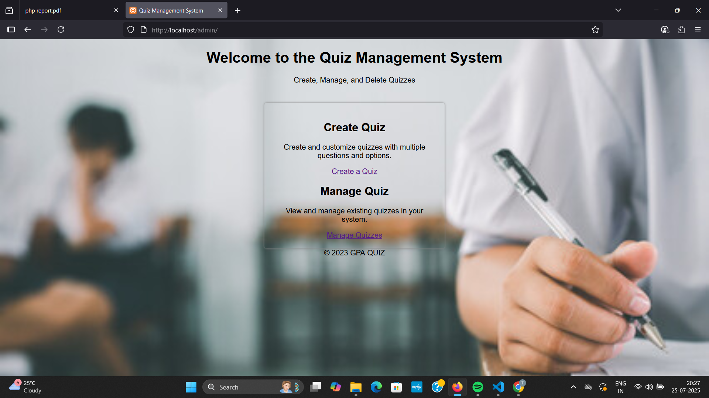
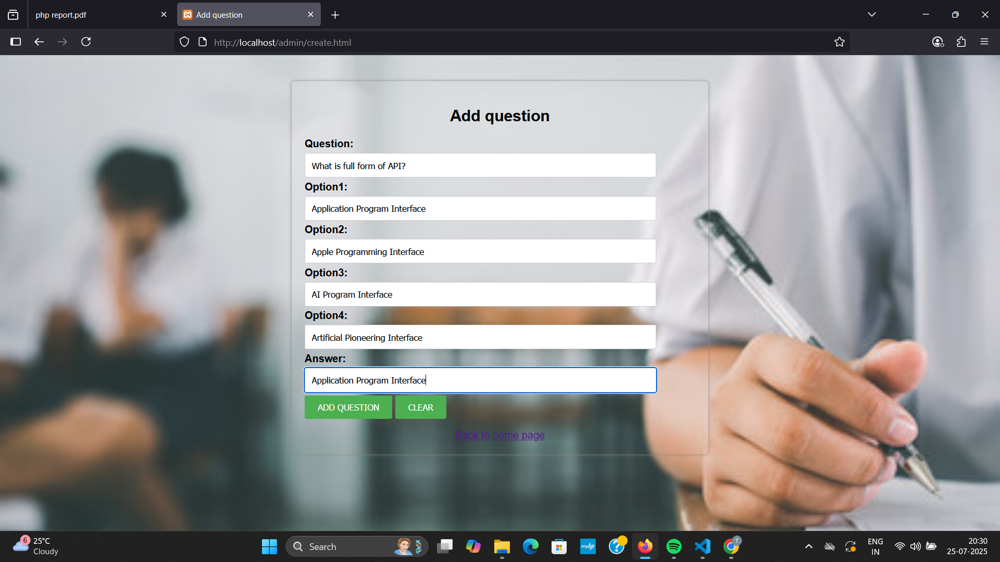
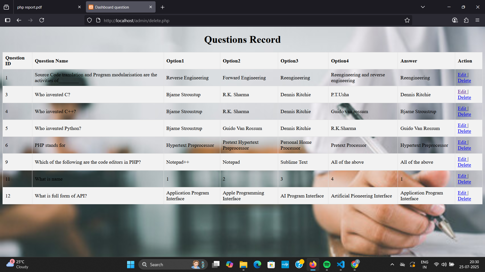
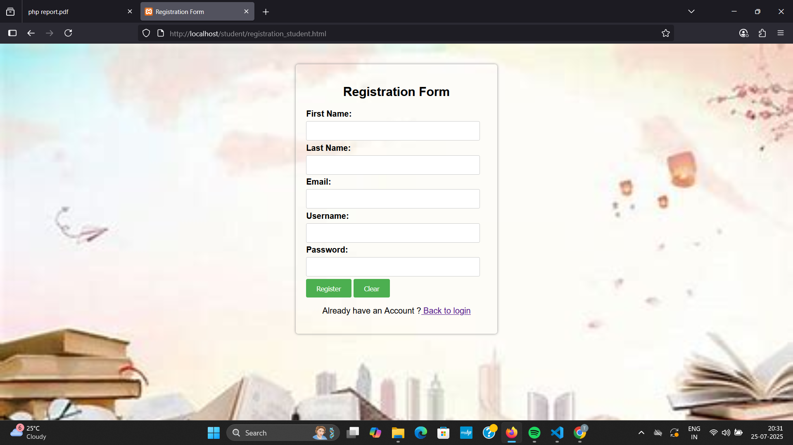
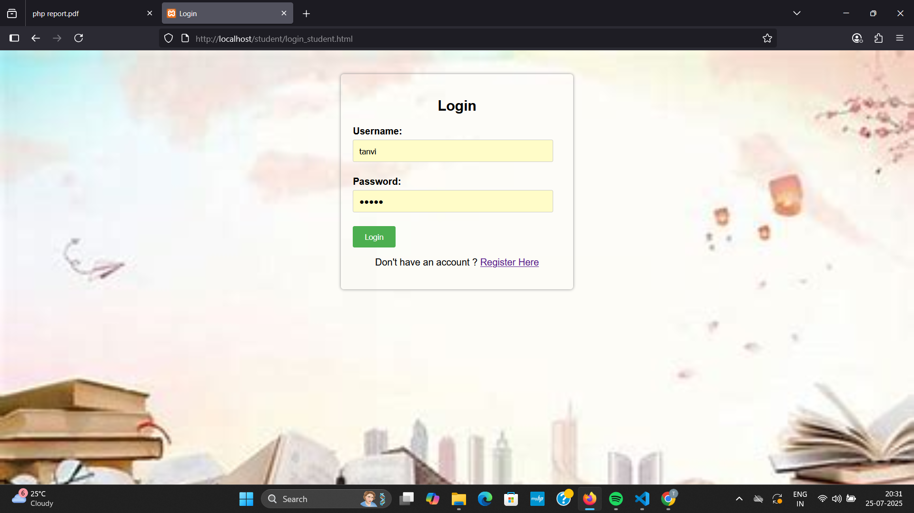
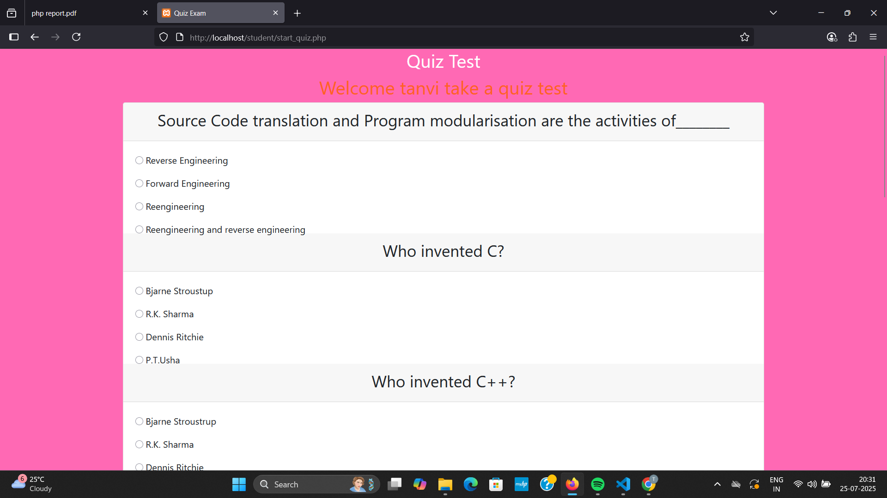

# 🎯 Quiz Management System (PHP + MySQL)

Welcome to the **Quiz Management System** — a simple and effective web application built using **PHP**, **MySQL**, **HTML**, and **CSS**. This project is designed to manage and conduct online quizzes efficiently for students and administrators.

---

## 📌 Features

✨ **Admin Panel**  
- Add, Edit, and Delete Quiz Questions  
- Manage Student Accounts  
- View Quiz Results

👨‍🎓 **Student Panel**  
- Register/Login securely  
- Attempt quizzes with question navigation  
- View scores after submission

🧩 **Quiz Module**  
- Multiple-choice questions  
- One question at a time display  
- Result calculated immediately

---

## 🛠️ Tech Stack

| Technology | Role               |
|------------|--------------------|
| PHP        | Server-side logic  |
| MySQL      | Database            |
| HTML/CSS   | Frontend design     |
| XAMPP      | Local server setup  |

## 📸 Screenshots

### 🛠️ Admin Panel

| Title | Image |
|-------|-------|
| **1️⃣ Create and Manage Quiz Page** |  |
| **2️⃣ Add a Question** |  |
| **3️⃣ Manage Quiz (Update/Delete Questions)** |  |

---

### 🎓 Student Panel

| Title | Image |
|-------|-------|
| **1️⃣ Registration Page** |  |
| **2️⃣ Login Page** |  |
| **3️⃣ Welcome Page** |  |
| **4️⃣ Quiz Questions Page** |  |
| **5️⃣ Result Page** |  |
